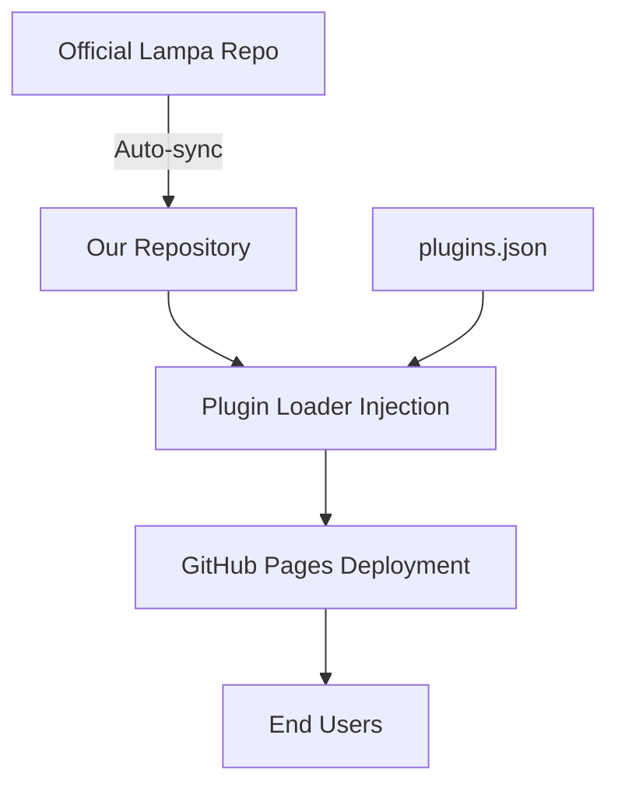

# 🎬 Lampa Clean Mirror

> A clean, ad-free version of Lampa with integrated custom plugin marketplace

[](https://github.com/pages)
[](LICENSE)
[](CHANGELOG.md)

## 🎯 Overview

Lampa Clean Mirror is an automated deployment of the official [Lampa](https://github.com/lampa-app/Lampa) application, enhanced with:

- ✨ **Zero advertisements** - Completely ad-free experience
- 🔌 **Custom plugin marketplace** - Curated collection of verified plugins
- 🔄 **Auto-updates** - Stays synchronized with official Lampa releases
- 🎨 **Clean codebase** - No third-party modifications, only official source + our plugin loader
- 🛡️ **Privacy-focused** - No tracking or analytics

## 🚀 Quick Start

### For Users

1. **Access the app**: Visit `https://[your-username].github.io/lampa-clean`
2. **Browse plugins**: Open "My Plugins" menu
3. **Install plugins**: Click any plugin to install instantly
4. **Enjoy**: Watch your favorite content ad-free!

### For Developers

```bash
# Clone the repository
git clone https://github.com/[your-username]/lampa-clean.git
cd lampa-clean

# Install dependencies (if any)
npm install

# Run locally
npm start
```

## 📦 Plugin Categories

Our marketplace includes plugins across 5 categories:

- 🎥 **Online Streaming** - VOD services and streaming providers
- 🌊 **Torrents** - Torrent integration and management
- 📺 **IPTV & TV** - Live TV and IPTV services
- 🛠️ **Utilities** - Themes, sync, and enhancement tools
- 🔞 **18+ Content** - Adult content plugins (optional)

## 🏗️ Architecture



### Key Components

- **`loader.js`** - Plugin marketplace UI and installation logic
- **`plugins.json`** - Plugin database with metadata
- **`index.html`** - Modified entry point with loader injection
- **`.github/workflows/`** - Automated update and deployment

## 🔧 Configuration

### Adding New Plugins

Edit `plugins.json`:

```json
{
  "name": "Plugin Name",
  "url": "https://example.com/plugin.js",
  "auto_load": false
}
```

### Auto-load Plugins

Set `auto_load: true` for plugins that should run automatically (e.g., ad blockers):

```json
{
  "name": "No CUB Premium Ads",
  "url": "https://bylampa.github.io/cub_off.js",
  "auto_load": true
}
```

## 🛠️ Development

### Project Structure

```
lampa-clean/
├── docs/                  # Documentation
│   ├── ARCHITECTURE.md    # System architecture
│   ├── INSTRUCTIONS.md    # Setup instructions
│   └── CONTRIBUTING.md    # Contribution guidelines
├── src/                   # Source code
│   ├── loader.js          # Plugin loader
│   └── styles/            # Custom styles
├── plugins.json           # Plugin database
├── index.html             # Entry point
├── CHANGELOG.md           # Version history
├── ROADMAP.md             # Future plans
└── README.md              # This file
```

### Building

The project uses GitHub Actions for automated builds:

1. Pulls latest Lampa source
2. Applies our modifications
3. Deploys to GitHub Pages

## 📋 Roadmap

See [ROADMAP.md](ROADMAP.md) for detailed plans.

### Version 1.0 (Current)
- ✅ Clean Lampa deployment
- ✅ Custom plugin marketplace
- ✅ Ad-free experience
- ✅ Auto-update mechanism

### Version 2.0 (Planned)
- 🔄 Advanced plugin management
- 🔄 Offline mode support
- 🔄 Cross-device sync
- 🔄 Enhanced UI/UX
- 🔄 Plugin development SDK

## 🤝 Contributing

We welcome contributions! Please see [CONTRIBUTING.md](docs/CONTRIBUTING.md) for guidelines.

## 📜 License

This project is licensed under the MIT License - see the [LICENSE](LICENSE) file for details.

## ⚠️ Disclaimer

This project is a mirror and enhancement of the official Lampa application. We are not affiliated with the original Lampa developers. All credit for the core application goes to the [Lampa team](https://github.com/lampa-app).

## 🙏 Acknowledgments

- [Lampa Team](https://github.com/lampa-app) - Original application
- Plugin developers - Community contributions
- Contributors - Everyone who helps improve this project

## 📞 Support

- 📖 [Documentation](docs/)
- 🐛 [Issue Tracker](https://github.com/[your-username]/lampa-clean/issues)
- 💬 [Discussions](https://github.com/[your-username]/lampa-clean/discussions)

---

Made with ❤️ for the Lampa community
