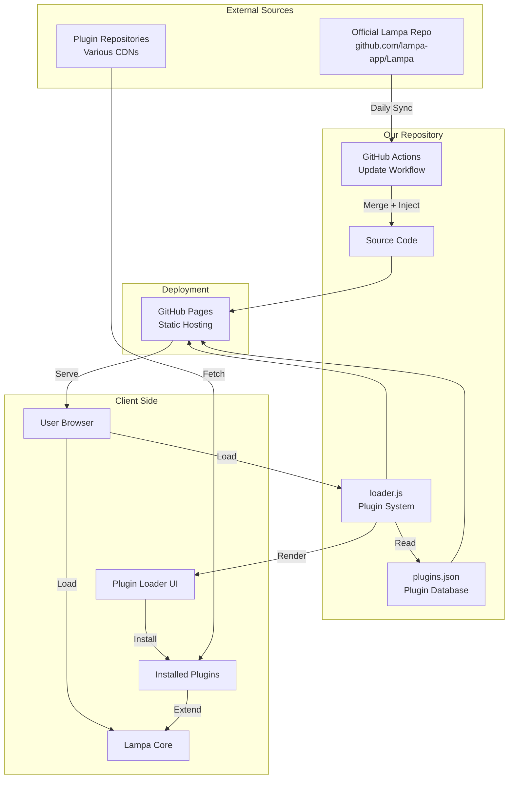
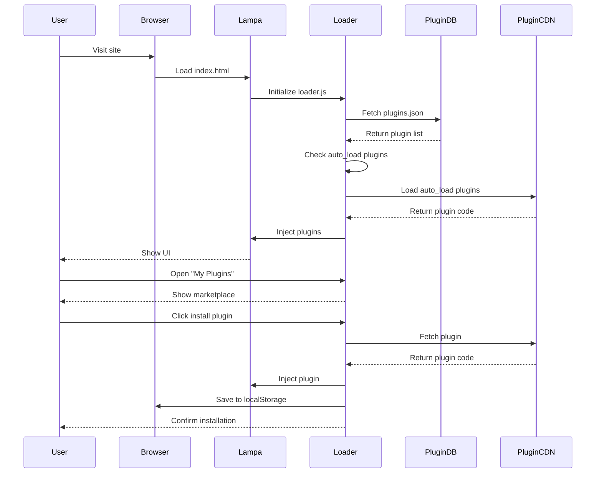
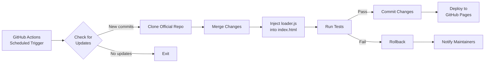

# 🏗️ Architecture Documentation

## System Overview

Lampa Clean Mirror is a static web application that combines the official Lampa source code with a custom plugin management system. The architecture is designed to be:

- **Maintainable**: Easy to update and modify
- **Transparent**: Clear separation between official code and our modifications
- **Automated**: Self-updating with minimal manual intervention
- **Secure**: Sandboxed plugins and content security policies

## Architecture Diagram



## Component Architecture

### 1. Core Components

#### 1.1 Official Lampa Core
- **Source**: `https://github.com/lampa-app/Lampa`
- **Purpose**: Provides the base application functionality
- **Update Strategy**: Automated daily sync via GitHub Actions
- **Modifications**: None (we only inject our loader)

#### 1.2 Plugin Loader (`src/loader.js`)
- **Purpose**: Custom plugin marketplace and installation system
- **Responsibilities**:
  - Load and parse `plugins.json`
  - Render plugin marketplace UI
  - Handle plugin installation/uninstallation
  - Manage auto-load plugins
  - Persist plugin state in localStorage

#### 1.3 Plugin Database (`plugins.json`)
- **Purpose**: Centralized plugin registry
- **Format**: JSON with categorized plugins
- **Schema**:
```json
{
  "groups": [
    {
      "title": "Category Name",
      "plugins": [
        {
          "name": "Plugin Name",
          "url": "https://...",
          "description": "Optional description",
          "auto_load": false,
          "version": "1.0.0",
          "author": "Author Name"
        }
      ]
    }
  ]
}
```

### 2. Data Flow



### 3. Update Mechanism



## Technical Decisions

### Why GitHub Pages?
- ✅ Free hosting
- ✅ HTTPS by default
- ✅ CDN distribution
- ✅ Easy deployment
- ✅ Version control integration

### Why Static Site?
- ✅ No server maintenance
- ✅ Infinite scalability
- ✅ Fast load times
- ✅ Simple deployment
- ✅ Works offline (with PWA)

### Why localStorage for Plugins?
- ✅ No backend required
- ✅ Instant persistence
- ✅ Privacy-friendly (local only)
- ✅ Simple API
- ⚠️ Limited to ~5-10MB (acceptable for plugin URLs)

### Why JSON for Plugin Database?
- ✅ Human-readable
- ✅ Easy to edit
- ✅ Git-friendly (clear diffs)
- ✅ No build step required
- ✅ Native browser support

## Security Considerations

### Content Security Policy
```html
<meta http-equiv="Content-Security-Policy" 
      content="default-src 'self'; 
               script-src 'self' 'unsafe-inline' https://trusted-cdn.com; 
               style-src 'self' 'unsafe-inline';
               img-src 'self' data: https:;
               connect-src *;">
```

### Plugin Sandboxing
- Plugins run in same context (limitation of current architecture)
- **v2 Plan**: Implement iframe sandboxing for untrusted plugins
- **Current Mitigation**: Curated plugin list only

### Privacy
- No analytics or tracking
- No external API calls (except plugin sources)
- All data stored locally
- No user accounts or authentication

## Performance Optimization

### Load Time Optimization
1. **Lazy Loading**: Plugins loaded on-demand
2. **Caching**: Aggressive browser caching for static assets
3. **Minification**: All JS/CSS minified in production
4. **CDN**: GitHub Pages CDN for global distribution

### Runtime Optimization
1. **Virtual DOM**: (if using framework in v2)
2. **Debouncing**: Search and filter operations
3. **Pagination**: Large plugin lists paginated
4. **Web Workers**: Heavy operations offloaded (v2)

## Storage Architecture

### localStorage Schema

```javascript
{
  // Installed plugins
  "lampa_plugins": [
    {
      "name": "Plugin Name",
      "url": "https://...",
      "installed_at": "2026-02-02T00:00:00Z",
      "enabled": true
    }
  ],
  
  // Plugin settings
  "lampa_plugin_settings": {
    "plugin_name": {
      "setting_key": "value"
    }
  },
  
  // User preferences
  "lampa_preferences": {
    "theme": "dark",
    "language": "ru",
    "auto_update": true
  }
}
```

## Deployment Pipeline

### CI/CD Workflow

```yaml
name: Update and Deploy

on:
  schedule:
    - cron: '0 0 * * *'  # Daily at midnight
  workflow_dispatch:      # Manual trigger

jobs:
  update:
    runs-on: ubuntu-latest
    steps:
      - name: Checkout our repo
      - name: Fetch official Lampa
      - name: Merge changes
      - name: Inject loader
      - name: Run tests
      - name: Deploy to GitHub Pages
```

## Error Handling

### Plugin Load Failures
```javascript
try {
  await loadPlugin(url);
} catch (error) {
  console.error(`Failed to load plugin: ${error}`);
  showNotification('Plugin failed to load', 'error');
  // Remove from installed list
  removePlugin(url);
}
```

### Network Failures
- Retry mechanism with exponential backoff
- Fallback to cached version
- User notification with manual retry option

### Storage Quota Exceeded
- Automatic cleanup of old plugins
- User notification to manage plugins
- Export/import functionality for backup

## Scalability Considerations

### Current Limits
- ~100 plugins (JSON parsing performance)
- ~5MB total plugin code (localStorage limit)
- Single-threaded execution

### v2 Improvements
- IndexedDB for unlimited storage
- Web Workers for parallel loading
- Virtual scrolling for 1000+ plugins
- Plugin CDN with caching

## Browser Compatibility

### Minimum Requirements
- Chrome 90+
- Firefox 88+
- Safari 14+
- Edge 90+

### Progressive Enhancement
- Core features work on all browsers
- Advanced features (PWA, etc.) for modern browsers
- Graceful degradation for older browsers

## Monitoring & Analytics

### Error Tracking (Optional, Privacy-First)
- Client-side error logging
- No personal data collection
- Aggregated statistics only
- Opt-in only

### Performance Metrics
- Page load time
- Plugin installation time
- Memory usage
- Network requests

## Future Architecture (v2)

### Planned Improvements
1. **Microservices**: Separate plugin API service
2. **CDN**: Custom CDN for plugin hosting
3. **Database**: Backend for plugin ratings/reviews
4. **WebAssembly**: Performance-critical operations
5. **Service Workers**: Offline support and caching
6. **WebRTC**: Watch party functionality

---

**Last Updated**: February 2, 2026  
**Version**: 1.0.0
